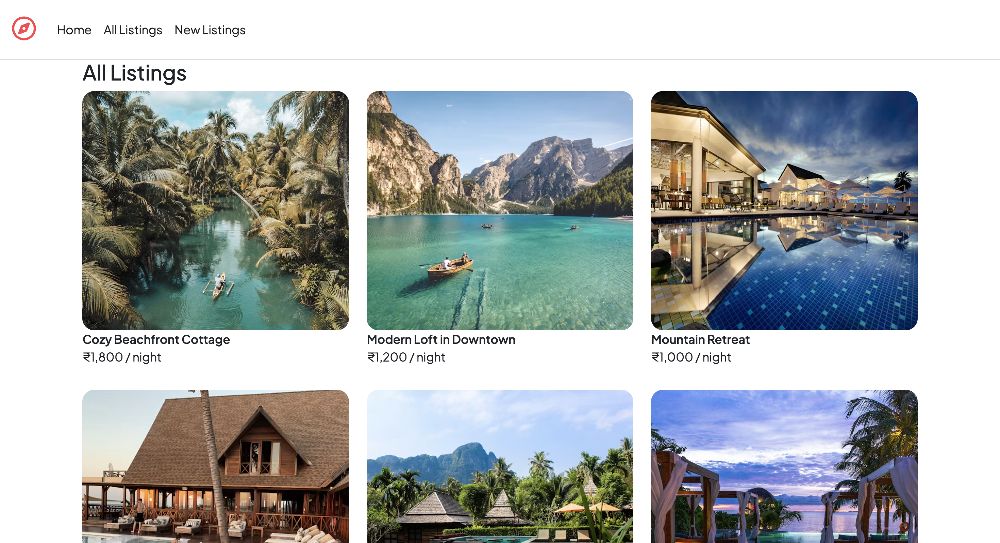
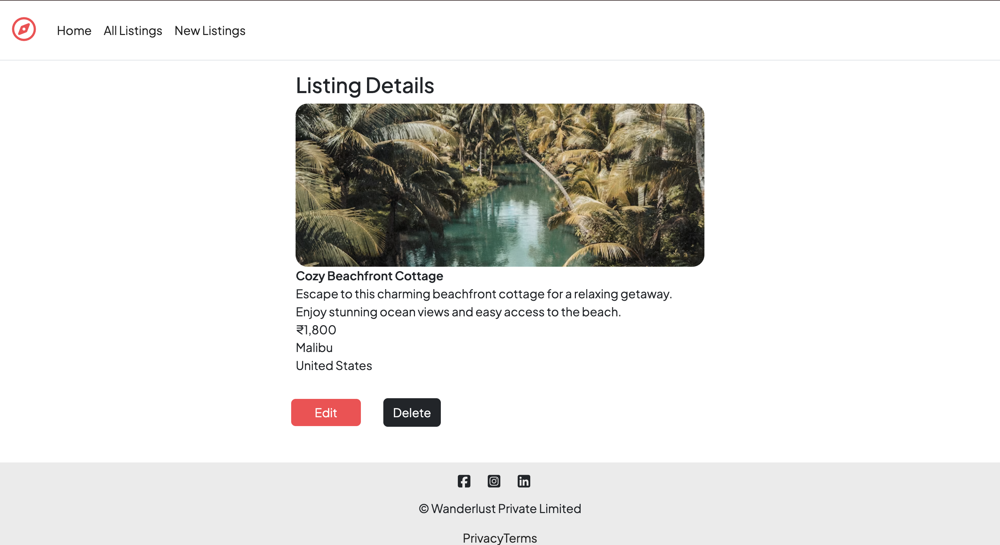
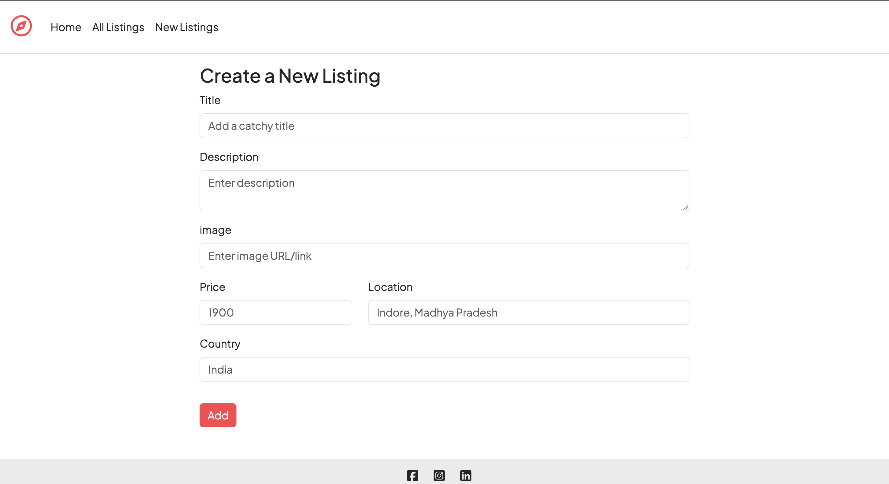
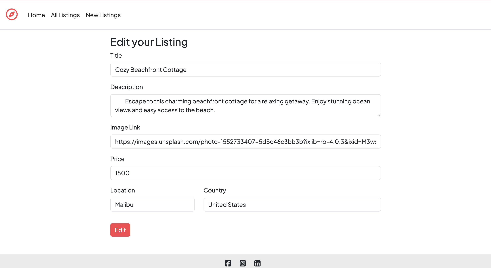

# 🏡 Stayora


Stayora is a full-stack property listing web application inspired by modern vacation-rental platforms.

Users can explore available properties, view listing details, create new listings, edit existing listings, and delete listings.

## 🌐 Live Demo

🚧 Coming soon...

The project is currently running locally and will be deployed soon.

## 🚀 Features

- 🏠 View all property listings
- 🔍 View individual listing details
- ➕ Create new listings
- ✏️ Edit listings
- 🗑️ Delete listings
- 📱 Responsive UI
- 🎨 Bootstrap styling
- 🗄️ MongoDB database
- 🔄 RESTful routing
- 📄 Dynamic pages using EJS

## ✨ Project Highlights

- Built a complete CRUD-based property listing application
- Implemented RESTful routing using Express.js
- Connected the application to MongoDB using Mongoose
- Used EJS and EJS-Mate for dynamic page rendering
- Created reusable Navbar and Footer components
- Used Bootstrap for responsive and clean UI
- Implemented listing creation, editing, viewing, and deletion
- Organized the project using a structured MVC-style architecture

## 🧠 What I Learned

Building Stayora helped me gain practical experience in:

- Backend development with Node.js and Express.js
- MongoDB database operations
- Mongoose schemas and models
- CRUD operations
- RESTful routing
- EJS templating and layouts
- Express middleware
- Form handling and validation
- Bootstrap-based responsive UI
- Git and GitHub workflow

## 🛠️ Tech Stack

- **Frontend:** HTML, CSS, JavaScript, Bootstrap
- **Backend:** Node.js, Express.js
- **Database:** MongoDB, Mongoose
- **Templating:** EJS, EJS Mate
- **Tools:** Git, GitHub, VS Code, Nodemon

## 📸 Screenshots

### 🏠 Home / Listings



### 🏡 Listing Details



### ➕ Create Listing



### ✏️ Edit Listing



## 📂 Project Structure

```text

Stayora/

│

├── init/

├── models/

├── public/

├── views/

│   ├── includes/

│   ├── layouts/

│   └── listings/

│

├── app.js

├── package.json

├── package-lock.json

└── README.md
```
