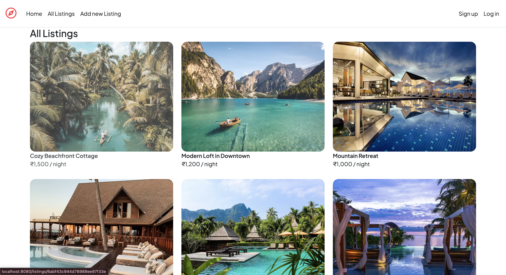
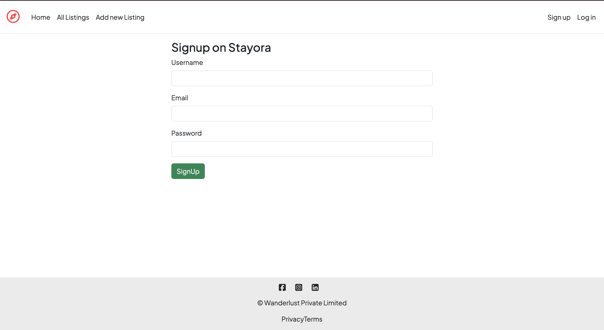
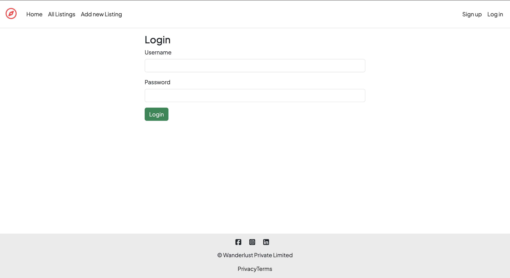
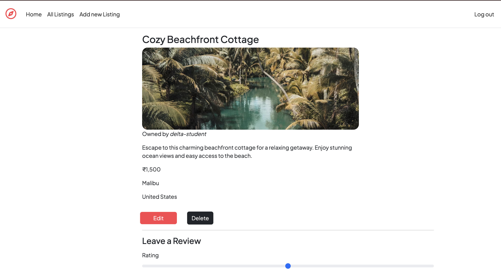
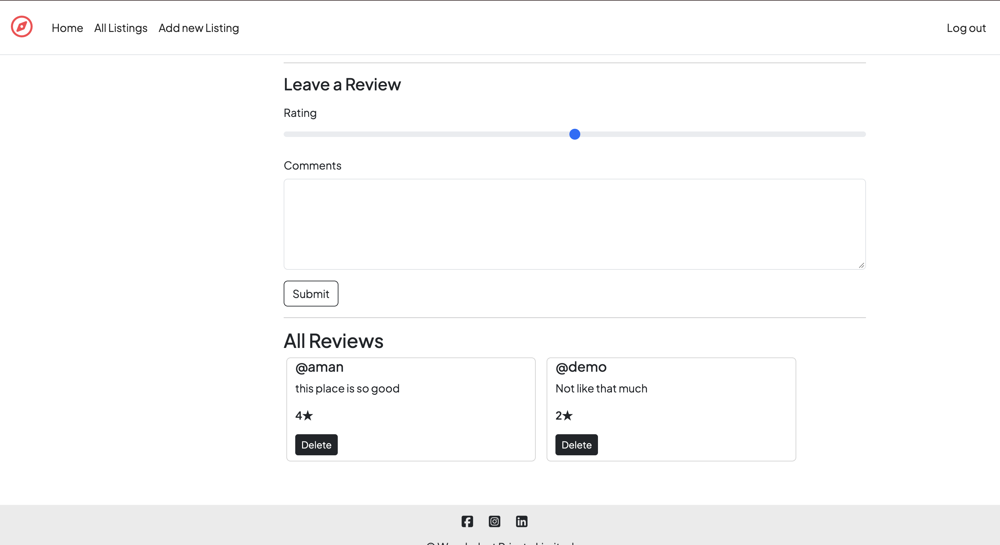
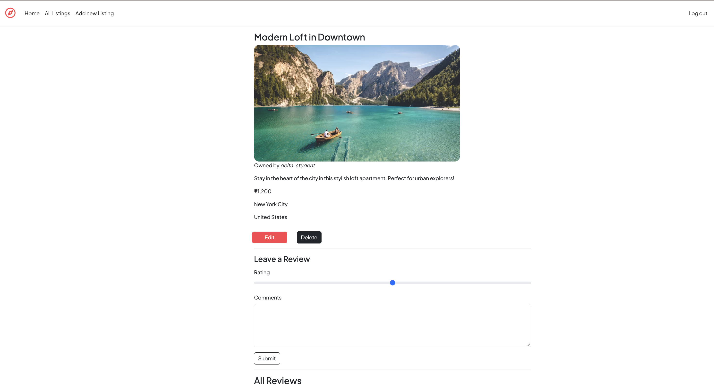

# 🏡 Stayora


Stayora is a full-stack property rental web application inspired by modern vacation-rental platforms.

Users can explore properties, view listing details, create and manage listings, authenticate securely, and leave reviews and ratings.

## 🌐 Live Demo

🚧 Coming soon...

The project is currently running locally and will be deployed soon.

## 🚀 Features

### 🔐 Authentication
- User signup and login
- Logout functionality
- Passport.js authentication
- Express-session based session management
- Cookie-based authentication
- Flash messages for user feedback

### 🔒 Authorization
- Protected routes for authenticated users
- Listing ownership authorization
- Review ownership authorization
- Users can only edit/delete their own listings
- Users can only delete their own reviews

### 🏠 Property Listings
- View all property listings
- View individual listing details
- Create new listings
- Edit existing listings
- Delete listings
- Owner-based listing management

### ⭐ Reviews & Ratings
- Add reviews to listings
- Rating system
- Display reviews on listing pages
- Delete reviews
- Review authorization

### 🎨 User Interface
- Responsive UI
- Bootstrap styling
- Dynamic pages using EJS
- Reusable Navbar and Footer
- Flash messages for success/error feedback

## 🧠 Backend Concepts Implemented

- RESTful routing
- MVC-style project structure
- Authentication & Authorization
- Passport.js
- Express Sessions
- Cookies
- Express Middleware
- Protected Routes
- CRUD Operations
- MongoDB & Mongoose
- EJS Server-Side Rendering
- Flash Messages
- Form Validation
- Error Handling

## ✨ Project Highlights

- Built a full-stack CRUD-based property rental application
- Implemented RESTful routing using Express.js
- Connected the application to MongoDB using Mongoose
- Implemented user authentication using Passport.js
- Implemented authorization using custom Express middleware
- Added signup, login and logout functionality
- Implemented session management using Express-session
- Used cookies for session-based authentication
- Added flash messages for success and error feedback
- Implemented protected routes and ownership-based authorization
- Built a review and rating system
- Added authorization for listing and review operations
- Used EJS and EJS-Mate for dynamic page rendering
- Created reusable Navbar and Footer components
- Used Bootstrap for responsive UI
- Organized the project using a structured MVC-style architecture

## 🧠 What I Learned

Building Stayora helped me gain practical experience in:

- Backend development with Node.js and Express.js
- MongoDB database operations
- Mongoose schemas and models
- CRUD operations
- RESTful routing
- Authentication using Passport.js
- Authorization and protected routes
- Express-session and cookies
- Express middleware
- Flash messages
- EJS templating and layouts
- Form handling and validation
- Error handling
- Review and rating systems
- Bootstrap-based responsive UI
- Git and GitHub workflow

## 🛠️ Tech Stack

- **Frontend:** HTML, CSS, JavaScript, Bootstrap
- **Backend:** Node.js, Express.js
- **Database:** MongoDB, Mongoose
- **Authentication:** Passport.js
- **Session Management:** Express-session, Cookies
- **Templating:** EJS, EJS-Mate
- **Other:** Express Middleware, Flash Messages
- **Tools:** Git, GitHub, VS Code, Nodemon

## 📸 Screenshots

### 🏠 Home / Listings



### 🔐 Signup



### 🔑 Login



### 🏡 Listing Details



### ⭐ Reviews



### 💬 Flash Messages


### ✏️ Edit Listing



## 📁 Project Structure

```text
Stayora/
├── init/
├── models/
├── public/
├── routes/
├── screenshots/
├── utils/
├── views/
│   ├── includes/
│   ├── layouts/
│   ├── listings/
│   └── users/
├── app.js
├── middleware.js
├── package.json
├── package-lock.json
└── README.md
```
